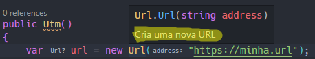
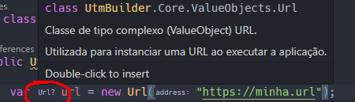
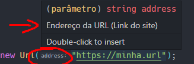
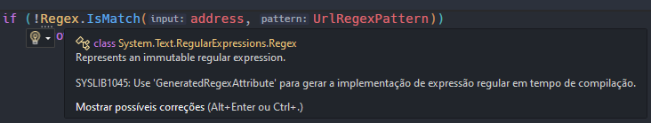

# Utm Builder

Projeto para estudo e revisão de conceitos usando C# 11 e .NET7
Curso [balta.io](https://github.com/balta-io/2818)

Utm | Urchin Traffic Monitor. O monitor de tráfego Urchin são os segmentos de URL usados no Google Analytics.

Vamos criar um construtor de URL. 👍

## Criando a solution

A solution é criada para trabalhar e agrupar diversos projetos no Csharp.

```csharp
// Cria a solution
dotnet new sln

// Dentro da pasta UtmBuilder crie o classlib como projeto principal:
dotnet new classlib -o UtmBuilder.Core

// Para vincular a nova biblioteca (DLL) criada a solution, execute:
dotnet sln add .\UtmBuilder.Core\
```

Executando um **dotnet build**, todos os projetos referenciados na solução são compilados.

## Organizando as Entidades

Em todo projeto, comece pelo começo! É hora da modelagem, organize o código e separe as classes em Entidades.

```csharp
// Classe básica do monitor de trafego. Aqui usamos as propriedades de tipos primitivos.
// Vamos melhorar, criando Value Objects para essas propriedades, evoluindo o código.
public class Utm
{
    public string Url { get; private set; }
    public string Source { get; private set; }
    public string Medium { get; private set; }
    public string Name { get; private set; }
    public string Id { get; private set; }
    public string Term { get; private set; }
    public string Content { get; private set; }
}
```

Os **ValueObjects** são os tipos complexos de propriedades. Com eles, podemos organizar os comportamentos dos tipos, melhorando as validações e centralizando as regras de negócio no código.

```csharp
// Todas aquelas propriedades fazem mais sentido serem parte de uma campanha né 😄
// No Utm precisamos de uma Url e uma campanha.
public class Campaign : ValueObject
{
    public string Id { get; private set; }
    public string Source { get; private set; }
    public string Medium { get; private set; }
    public string Name { get; private set; }
    public string Term { get; private set; }
    public string Content { get; private set; }
}
```

## Nullables

As versões a partir do .NET6 ficam alertando sobre as propriedades serem nulas. Para resolver esses alertas, temos 4 formas:

```csharp
public class Utm
{
    // 1 - Inicializando a propriedade (new()) com uma nova instância do objeto do mesmo tipo.
    public Guid Id { get; private set; } = new();

    // 2 - Caso seja permitido no contexto, atribuir a propriedade para aceitar
    // valor nulo com o interrogação (?).
    public Url? Url { get; private set; }

    // 3 - Atribuir a propriedade com o null not (null!). Assim indicamos que futuramente
    // essa propriedade receberá um valor, pois no momento não há como passar um valor.
    public Campaign Campaign { get; private set; } = null!;
}

public class Utm
{
    // 4- Criar um método construtor passando os valores para as propriedades via parâmetro.
    public Utm(Url url, Campaign campaign)
    {
        Url = url;
        Campaign = campaign;
    }

    public Url Url { get; private set; }
    public Campaign Campaign { get; private set; }
}
```

Caso a propriedade receba um valor nulo, será lançado o famoso **ObjectNullReferenceException** 😢.

## Private set

Os private set blindam os ValueObjects de alterações fora da classe. Dessa forma, podemos criar métodos de atualização com comportamentos e tratamentos caso o valor de uma propriedade precise ser alterado durante a execução da aplicação.

```csharp
public class Url : ValueObject
{
    // Só posso passar o valor ao criar um novo objeto Url
    public Url(string address)
    {
        Address = address;
    }

    public string Address { get; private set; }

    // Caso precise alterar o valor, é permitido apenas usando o método UpdateUrl
    void UpdateUrl()
    {
        Address = "https://enredeco.atualizado.por.um.metodo";
    }
}
```

No caso de uma propriedade ser imutável e seu valor ser definido apenas na inicialização, basta omitir o private set.

```csharp
...
public string Address { get; }
```

## Optional parameters

Podemos definir os parâmetros opcionais com construtores com assinaturas diferentes, onde um passa os parâmetros obrigatórios e o outro passa todos os parâmetros.

Uma forma mais simples é inicializar os parâmetros opcionais como null em um construtor único.

```csharp
// Seguindo as regras de negócio do Utm do Google Analytics
public class Campaign : ValueObject
{
    public Campaign(
        string source,
        string medium,
        string name,
        string? id = null,
        string? term = null,
        string? content = null)
    {
        Source = source;
        Medium = medium;
        Name = name;
        Id = id;
        Term = term;
        Content = content;
    }

    public string Source { get; private set; } = null!;
    public string Medium { get; private set; } = null!;
    public string Name { get; private set; } = null!;

    public string? Id { get; private set; }
    public string? Term { get; private set; }
    public string? Content { get; private set; }
}
```

## Summary

É a descrição do que são as propriedades e seus comportamentos. Assim documentamos as classes para nós e outros programadores terem uma boa referência. Esse padrão é utilizado por todas as classes do .NET

```csharp
/// <summary>
/// Classe de tipo complexo (ValueObject) URL. <br />
/// Utilizada para instanciar uma URL ao executar a aplicação. <br />
/// </summary>
public class Url : ValueObject
{
    /// <summary>
    /// Cria uma nova URL
    /// </summary>
    /// <param name="address">Endereço da URL (Link do site)</param>
    public Url(string address)
    {
        Address = address;
    }

    /// <summary>
    /// Endereço da URL (Link do site)
    /// </summary>
    public string Address { get; }
}
```

As dicas também são exibidas no editor como nas imagens abaixo:

Exemplo ao passar o mouse sobre o **new Url**.



Exemplo ao passar o mouse sobre o tipo da variável.



Exemplo ao passar o mouse sobre o parâmetro.



## Regex

Agora com as entidades definidas é hora de fazer as validações com expressões regulares.

```csharp
// Constante privada, ninguém precisa acessar esse valor imutável.
private const string UrlRegexPattern =
    @"^
        (http|https):(\/\/www\.|\/\/www\.|\/\/|\/\/)
        [a-z0-9]+([\-\.]{1}[a-z0-9]+)*\.[a-z]{2,5}
        (:[0-9]{1,5})?
        (\/.*)?
        $
        |
        (http|https):(
          \/\/localhost:\d*
          |\/\/127\.
          ([0-9]|[1-9][0-9]|1[0-9][0-9]|2[0-4][0-9]|25[0-5])\.
          ([0-9]|[1-9][0-9]|1[0-9][0-9]|2[0-4][0-9]|25[0-5])\.
          ([0-9]|[1-9][0-9]|1[0-9][0-9]|2[0-4][0-9]|25[0-5])
        )
        (:[0-9]{1,5})?
        (\/.*)?
      $";
```

Explicando a expressão:

`^` -> início da string.

`(http|https):(\/\/www\.|\/\/www\.|\/\/|\/\/)` -> esquema de URL começando com "http" ou "https", seguido por "`://www.`" ou "`//www.`" ou "`//`" ou "`/`".

`[a-z0-9]+([-\.]{1}[a-z0-9]+)_\.[a-z]{2,5}:` -> corresponde a um nome de domínio válido.
Pode incluir um hífen ou um ponto em qualquer lugar, exceto no início ou no final do nome de domínio.
Também requer um TLD - Top-Level Domain de duas a cinco letras minúsculas "`.com`", "`.io`"
(ex: `meu-dominio.valido.io`)

`(:[0-9]{1,5})?:` -> porta opcional que segue o nome de domínio e consiste em dois pontos seguidos de um número de 1 a 5 dígitos (ex: dominio.com`:8080`).

`(\/.\_)?:` -> sequência de caracteres de caminho opcional que segue o nome do domínio e a porta, começando com uma barra (ex: meuendpoint`/`pedidos`/`254)

`$` -> final da string.

`|` -> escolha entre duas opções (ex: condição 1 OU condição 2. condição 1 `|` condição 2)

`(http|https)` -> escolhe entre "http" ou "https" como protocolo da URL.

`:` -> indica que após o protocolo, a URL deve conter um caractere de dois pontos.

`(\/\/localhost:\d*` -> representa a opção que começa com "localhost", seguido de dois pontos e zero ou mais dígitos (0-9) (ex: `localhost:8765`).

`\/\/127\.([0-9]|[1-9][0-9]|1[0-9][0-9]|2[0-4][0-9]|25[0-5])\.`
`([0-9]|[1-9][0-9]|1[0-9][0-9]|2[0-4][0-9]|25[0-5])\.`
`([0-9]|[1-9][0-9]|1[0-9][0-9]|2[0-4][0-9]|25[0-5])` -> opção que começa com o endereço IP "127." seguido de um número entre 0 e 255 (representado pela expressão regular dentro dos colchetes), seguido de um ponto e outro número de 0 a 255, e mais uma sequência entre 0 a 255 (ex: `127.0.0.1`).

`(:[0-9]{1,5})?` -> indica que a URL pode ter uma porta (separada por dois pontos) seguida de um número de 1 a 5 dígitos. O ponto de interrogação no final torna essa parte opcional (ex: endereco-url`:80` ou endereco-url).

`(\/.\*)?` -> indica que a URL pode ter um caminho (representado pelo caractere barra "`/`") seguido de qualquer coisa (representado pelo ponto e asterisco), também opcional (ex:`endpoint/_2343dFeS2qwe#@1`).

`$` -> indica o fim da expressão regular.

## Exceptions

Lançamos exceções para situações inesperadas. Para aquelas que sabemos que podem ocorrer, é melhorar gerar **notificações**.

```csharp
public Url(string address)
{
    Address = address;

    if (Regex.IsMatch(Address, UrlRegexPattern))
        throw new Exception("teste"); // Exceção do tipo mais genérico possível.
}
```

O problema de trabalhar com exceções assim é conseguir rastrear as informações, que muitas vezes são confundidas com exceções lançadas pelo próprio framework. Um debug fica muito custoso e complexo.

Para melhorar esse cenário, crie um classe I**InvalidUrlException** que herde de **Exception**.

Temos sempre que tratar as exceções da forma mais específica para mais genérica.

```csharp
public class InvalidUrlException : Exception
{
    private const string DefaultErrorMessage = "Invalid Url";
    private const string UrlRegexPattern = ...

    public InvalidUrlException(string message = DefaultErrorMessage)
    : base(message) // Chama o construtor pai (Exception), passando a mensagem como parâmetro
    {

    }

    // Método com as possíveis validações, sempre da mais específica para mais básica
    public static void ThrowIfInvalid(string address, string message = DefaultErrorMessage)
    {
        if (string.IsNullOrEmpty(address))
            throw new InvalidUrlException(message);

        if (!Regex.IsMatch(address, UrlRegexPattern))
            throw new InvalidUrlException();
    }
}
```

Agora a validação está concentrada de uma forma mais organizada. Na classe Url, precisamos apenas lançar exceções caso o endereço seja inválido.

```csharp
...
    public Url(string address)
    {
        Address = address;
        InvalidUrlException.ThrowIfInvalid(address);
    }
```

## Source Code Generators

Recurso novo do .NET7 que gera código otimizado durante a compilação. A IDE faz a sugestão para substituir o código.

Obs: Essa sugestão pode estar disponível apenas em IDE's como Visual Studio e Rider.



```csharp
[GeneratedRegex("^(http|https):(\\/\\/www\\...")]
private static partial Regex UrlRegex();
```

## Gerando o Utm

Para gerar o Utm podemos aproveitar dos melhores recursos do Csharp.

A intenção aqui é gerar uma url semelhante a essa estrutura:

```csharp
// Url de exemplo https://plataforma.io/pagina-promo?utm_source=YouTube&utm_campaign=segments
```

### Sobrescrita de método

Sobrescrever o método **ToString()** na classe filha é muito comum, lembrando que todos os tipos de objetos no Csharp são herdeiros implícitos do tipo **System** e podem utilizar ou alterar via sobrescrita todos os seus métodos.

```csharp
public class Utm
{
    ...
    public override string ToString()
    {
        return"";
    }
}
```

### Concatenando strings

Aqui podemos concatenar cada pedaço que irá compor a url. Existem varias maneiras de fazer isso:

```csharp
// Utilizando o mais(+):
var str = "https://" + "meusite.dom" + "?" + "utm_source"...

// Utilizando o objeto StringBuilder (melhor para strings muito grandes):
var str = new StringBuilder(64);
str.Append(Url);
str.Append("?utm_source=");
str.Append(Campaign.Source);

// Utilizando interpolação
var str = $"{Url.Address}?utm_source={Campaign.Source}";

// Usando Join (por enquanto mais performático)
return $"{Url.Address}?{string.Join("&", segments)}";
```

Para fazer testes de qual forma tem melhor performance, pode ser usado o pacote [Benchmark.Net](https://github.com/dotnet/BenchmarkDotNet) e simular os testes conforme esse video do [Balta](https://tinyurl.com/bench-dot-net).

### Métodos de extensão

Como visto em outros projetos do curso, podemos estender as funcionalidades dos métodos usando a palavra chave **this**, deixando nosso código mais adaptável e flexível as necessidades.

```csharp
...

public override string ToString()
{
    var segments = new List<string>();

    // Essas validações funcionam, mas se tornam repetitivas e poluem o código
    if (!string.IsNullOrEmpty(Campaign.Source))
        segments.Add(Campaign.Source);

    if (!string.IsNullOrEmpty(Campaign.Medium))
        segments.Add(Campaign.Medium);

    if (!string.IsNullOrEmpty(Campaign.Id))
        segments.Add(Campaign.Id);
}
```

Ao invés de criar uma série de condicionais repetitivas para avaliar os segmentos da lista, podemos apenas estender os métodos do tipo **List** reduzindo a duplicidade e mantendo o código mais limpo.

```csharp
public static class ListExtensions
{
    // Adicionado this na frente do List. Dessa forma representamos que esse método
    // é um método de extensão da classe List
    public static void AddIfNotNull(this List<string> list,
        string key,
        string? value)
    {
        // Somente adiciona um novo item a lista se o value não for nulo ou vazio.
        if (!string.IsNullOrEmpty(value))
            list.Add($"{key}={value}");
    }
}

...
public override string ToString()
{
    var segments = new List<string>();

    // Forma mais simples de validação
    segments.AddIfNotNull("utm_source", Campaign.Source);
    segments.AddIfNotNull("utm_medium", Campaign.Medium);
    segments.AddIfNotNull("utm_campaign", Campaign.Name);
    segments.AddIfNotNull("utm_id", Campaign.Id);
    segments.AddIfNotNull("utm_term", Campaign.Term);
    segments.AddIfNotNull("utm_content", Campaign.Content);
}
```

Ainda sim, é preferível trabalhar com **notificações**, deixando o código mais limpo e facilitando testes.

## Operador implícito

Os **implicit operators** ajudam nas conversões de tipo de objetos. Como informado na [Sobrescrita de método](#sobrescrita-de-método), o ToString() é um método disponível para todos os novos objetos.

Para não haver a necessidade de ficar invocando o mesmo ao instanciar um novo Utm, podemos criar:

```csharp
public static implicit operator string(Utm utm) => utm.ToString();
```

Dessa forma, sempre que o objeto for atribuído a alguma variável, não é necessário chamar o método para conversão. A mesma é feita implicitamente:

```csharp
//class Test
...
var utm = new Utm(Url, Campaign);

// Aqui o utm já faz a chamado do toString() de forma implícita.
string resultado = utm;
```

Agora conversão de uma string para Utm:

```csharp
public static implicit operator Utm(string link)
{
    // Ex url: https://plataforma.io/pagina-promo?utm_source=YouTube&utm_campaign=segments

    // Validação rápida no caso do link vir como nulo ou vazio.
    if (string.IsNullOrEmpty(link))
            throw new InvalidUrlException();

    // Cria um objeto do tipo url recebendo um link.
    var url = new Url(link);

    // cria um array de strings, separando a url a cada interrogação (?).
    var segments = url.Address.Split("?");

    // Se o tamanho do array for 1, não haverá segmentos para recuperar.
    if (segments.Length == 1)
        throw new InvalidUrlException("Nenhum segmento foi fornecido");

    // Cria um array de strings com o nome de pars (parâmetros).
    // Os segmentos são contados a partir da 2ª posição (1). Lembre que a contagem inicia em 0, 1, 2...
    // As quebras são feitas a cada "&" ("E" comercial).
    var pars = segments[1].Split("&");

    // Retorna uma string utilizando LINQ.
    // Procura nos parâmetros ONDE o elemento COMEÇA COM o segmento pesquisado,
    // trazendo o PRIMEIRO valor encontrado. Depois DIVIDE o valor a cada separador igual (=)
    // e retorna o valor da 2ª posição do array (1).
    var source = pars.Where(x => x.StartsWith("utm_source")).FirstOrDefault("").Split("=")[1];
    var medium = pars.Where(x => x.StartsWith("utm_medium")).FirstOrDefault("").Split("=")[1];
    var name = pars.Where(x => x.StartsWith("utm_campaign")).FirstOrDefault("").Split("=")[1];
    var id = pars.Where(x => x.StartsWith("utm_id")).FirstOrDefault("").Split("=")[1];
    var term = pars.Where(x => x.StartsWith("utm_term")).FirstOrDefault("").Split("=")[1];
    var content = pars.Where(x => x.StartsWith("utm_content")).FirstOrDefault("").Split("=")[1];

    // Cria um novo objeto Utm, passando um novo objeto Url com a 1ª parte do link
    // e passa um novo objeto do tipo Campanha, com os valores dos segmentos que compõem
    // a 2ª parte da Url.
    var utm = new Utm(
    new Url(segments[0]),
    new Campaign(source, medium, name, id, term, content));

    return utm;
}
```

Podemos fazer a seguinte chamada para conversão implícita do Utm para string.

```csharp
//class Test
...
var url = "https://balta.io/?utm_source=YouTube&utm_medium=med&utm_campaign=nme&utm_id=id&utm_term=ter&utm_content=ctn;";

string utm = (Utm)url;
```

## Testes de Unidade

Obs: Caso esteja usando o **VSCode**, habilite a criação dos arquivos de debug, que ficam na pasta **.vscode**

1. Crie um projeto de testes seguindo a convenção de nomenclatura **dotnet new mstest -o UtmBuilder.Core.Tests**

1. Adicione o projeto de testes a solução **dotnet sln add .\\UtmBuilder.Core.Tests\\**

1. Acesse o projeto de testes e faça referência ao projeto core **dotnet add reference ..\\UtmBuilder.Core\\**

### Organizando os testes

Avalie suas classes no projeto Core. Cada vez que houver uma condicional na classe (if, método de verificação, switch/case, etc.) teremos 2 casos de testes a serem realizados: **falha** e **sucesso**.

```csharp
// Estrutura básica de uma classe de teste
// Siga sempre um padrão, conforme definição do projeto
[TestClass]
public class UrlTests
{
    [TestMethod]
    [TestCategory("Teste de URL")]
    public void Deve_retornar_excecao_quando_a_url_for_invalida()
    {

    }
}
```

Modele todos os testes para **falhar**, depois faça eles **passarem** e **refatore** para os casos serem mais próximos da realidade. Essa é metodologia de mercado 🔴Red, 🟢Green, 💻Refactor.

### Testando por exceções

Podemos testar dessa forma com bloco **try/catch** para avaliação.

```csharp
[TestMethod]
[TestCategory("Teste de URL")]
public void Deve_retornar_excecao_quando_a_url_for_invalida()
{
    try
    {
        var url = new Url("123qwe");
        // Assegura que o teste irá falhar
        Assert.Fail();
    }
    catch (InvalidUrlException e)
    {
        // Assegura que o teste irá passar
        Assert.IsTrue(true);
    }
}
```

### Testando por exceções esperadas

Uma forma bem enxuta é adicionar o atributo ao método **ExpectedException**, passando qual o tipo de exceção deve ser lançada.

```csharp
// Exemplo com método que assegura falha na execução.
[TestMethod]
[TestCategory("Teste de URL")]
[ExpectedException(typeof(InvalidUrlException))]
public void Deve_retornar_excecao_quando_a_url_for_invalida()
{
    new Url("123qwe");
}

// Exemplo com método que assegura sucesso na execução.
[TestMethod]
[TestCategory("Teste de URL")]
public void Nao_Deve_retornar_excecao_quando_a_url_for_valida()
{
    new Url("https://youtube.com");
    Assert.IsTrue(true);
}
```

Também é valido criar constantes, melhorando a passagem de parâmetros

```csharp
    private const string InvalidUrl = "123qew";
    private const string ValidUrl = "https://youtube.com";
```

### Usando DataRow

Outra forma de testar a mesma condição com diversos parâmetros é essa.

```csharp
[TestMethod]
[TestCategory("Teste de URL")]

// A cada DataRow será executado um caso de teste, com a condição se é verdadeiro ou falso.
[DataRow(" ", true)]
[DataRow("http", true)]
[DataRow("plataforma", true)]
[DataRow("https://plataforma.com", false)] // Somente esse teste não espera exceção, com uma URL válida
public void Teste_Url(string link, bool expectException)
{
    // Se a condição é verdadeira, é pra acontecer uma exceção.
    if (expectException)
    {
        try
        {
            new Url(link);
            Assert.Fail();
        }
        catch (InvalidUrlException e)
        {
            Assert.IsTrue(true);
        }
    }
    else
    {
        // Se a condição for falsa, não acontece a exceção e o teste deve passar.
        new Url(link);
        Assert.IsTrue(true);
    }
}
```

### Catch When

Caso necessário testar somente uma parte da condição no bloco **try/catch**, pode ser usado o comando **when** com base na comparação por mensagem.

```csharp
// Trecho da classe de Testes da Campanha
if (expectException)
{
    try
    {
        new Campaign(source, medium, name);
        Assert.Fail();
    }
    catch (InvalidCampaignException e)
        // Só ira retornar o erro quando a mensagem de erro da exceção for igual a mensagem abaixo
        when(e.Message == "Source is invalid")
    {
        Assert.IsTrue(true);
    }
}
```

### Testando o Utm

Para finalizar, testamos a criação de um objeto **Utm**.

```csharp
[TestClass]
public class UtmTests
{
    private readonly Url _url = new("https://plataforma.io/");
    private readonly Campaign _campaign = new(
        "src",
        "med",
        "nme",
        "id",
        "trm",
        "ctn");
    private const string Result = "https://plataforma.io/"
            + "?utm_source=src"
            + "&utm_medium=med"
            + "&utm_campaign=nme"
            + "&utm_id=id"
            + "&utm_term=trm"
            + "&utm_content=ctn";

    [TestMethod]
    public void Deve_retornar_uma_url_de_um_utm()
    {
        var utm = new Utm(_url, _campaign);

        Assert.AreEqual(Result, utm.ToString());
        Assert.AreEqual(Result, (string)utm);
    }

    [TestMethod]
    public void Deve_retornar_um_utm_de_uma_url()
    {
        Utm utm = Result;

        Assert.AreEqual("https://plataforma.io/", utm.Url.Address);
        Assert.AreEqual("src", utm.Campaign.Source);
        Assert.AreEqual("med", utm.Campaign.Medium);
        Assert.AreEqual("nme", utm.Campaign.Name);
        Assert.AreEqual("id", utm.Campaign.Id);
        Assert.AreEqual("trm", utm.Campaign.Term);
        Assert.AreEqual("ctn", utm.Campaign.Content);
    }
}
```
